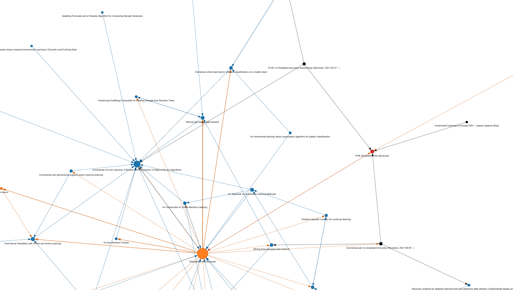

# notion-graph-view

Create an interactive graph view (driven by `pyvis`) of the linked pages in your [Notion](https://www.notion.so/) workspace.

Currently supports page mentions made in page's:

* title
* text properties
* body

Child pages are automatically linked to their parents, even without an explicit mention.

Links via [database relations](https://www.notion.so/Relations-rollups-fd56bfc6a3f0471a9f0cc3110ff19a79) are not yet supported.

## Usage

1. Create a Notion integration and add share some databases with it (steps 1 and 2 from [this guide](https://developers.notion.com/docs/getting-started)).
2. Create a file `config.json` in the root directory with contents:
    ```json
    {
        "token": "<your integration token>"
    }
    ```
3. Run:
    ```bash
    python run.py
    ```
4. Open file `graph.html` in browser.

The procedure takes some time if running for the first time (for me it was approx. 2-3 seconds per page). After that, only updates the previously crawled state, so should be quite quick.

The result is a zoomable graph, see example below:


